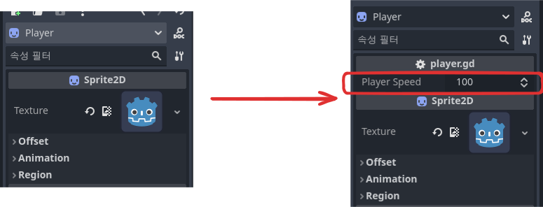

# Quest 1 - 무대 개장

## 퀘스트 내용
1. 게임 에디터를 설치하고 프로젝트를 생성하여 에디터를 실행해보세요
2. 2D Scene을 생성해보세요.
3. 2D Scene 에 아래와 같은 사각형 상자를 배치하세요
4. 게임을 실행했을 때 일정한 속도로 오른쪽으로 상자가 이동하는 기능을 추가해보세요

# 도움이 되는 질문
- Scene 무엇인가요? 
- 이 게임 엔진에서는 무엇으로 게임을 구성하나요? 게임 구성 요소의 가장 기본적인 형태는 무엇인가요? 어떻게 구성 요소의 기능이 확장되나요?
- 게임 구성 요소의 위치 정보는 어디에 있나요? (Keyword: Transform)
- Script란 무엇인가요? 이 게임 엔진은 어떤 script가 있나요?
- 게임의 구성 요소는 어떻게 초기화 하고 업데이트 되나요? (Keyword: Lifecycle, Frame)
- 게임 구성 요소의 위치 정보를 변경하려면 어떻게 해야 하나요?

## 추가 퀘스트
- 이동 속도를 에디터에서 변경할 수 있도록 기능을 추가해보세요.

