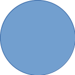
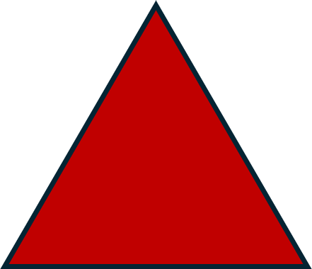
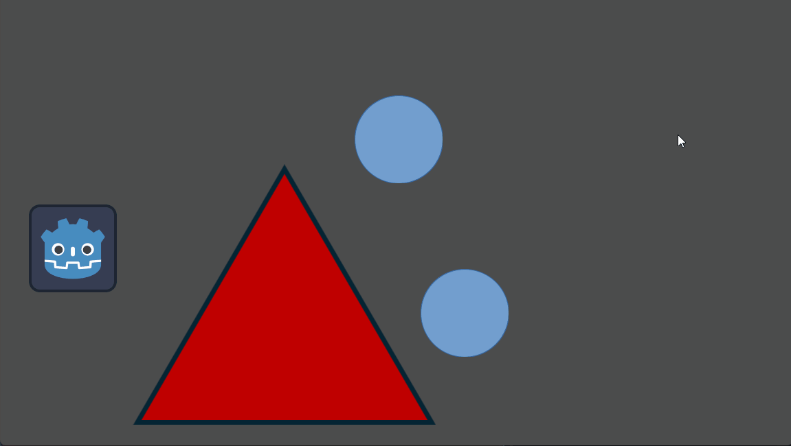

# Quest 2 - 움직이고, 먹고, 변하고
## 퀘스트 내용
1. 방향키 (혹은 WASD) 에 따라 움직이는 상자 (플레이어)가 움직이는 기능을 추가하세요
2. 동그라미, 세모 등의 다른 도형을 추가하고 플레이어가 이 도형에 접촉하면 사라지도록 하는 기능을 추가하세요.

3. 다른 도형이 사라질 때마다 플레이어의 크기를 변하도록 하는 기능을 추가하세요.

## 도움이 되는 질문
1. 게임 엔진에서 입력은 어떻게 처리할까요?
2. 게임 구성 요소의 모양, 그림 정보는 어디에서 담당하나요?
3. 미리 만든 똑같은 구성 요소를 따로 파일로 관리하고 복사해서 쓸 수 있지 않을까요? (Keyword: Template, Prefab)
4. 두 게임 구성 요소가 접촉, 충돌했다는 것을 어떻게 알 수 있을까요? 충돌했을 때 해야하는 처리를 어떻게 구현할까요?
5. 다른 구성요소에 있는 정보에 접근하려면 어떻게 해야할까요?

## 추가 퀘스트
1. 게임 시작 시 다른 도형들이 임의의 개수 및 위치에 생성되도록 하는 기능을 추가하세요.
2. 도형의 종류에 따라 커지는 크기가 달라지도록 만드세요. 
3. 2번의 크기가 커지는 정도를 코드에서 직접 수정하는 것이 아닌 에디터에서 수정할 수 있도록 기능을 추가하세요.