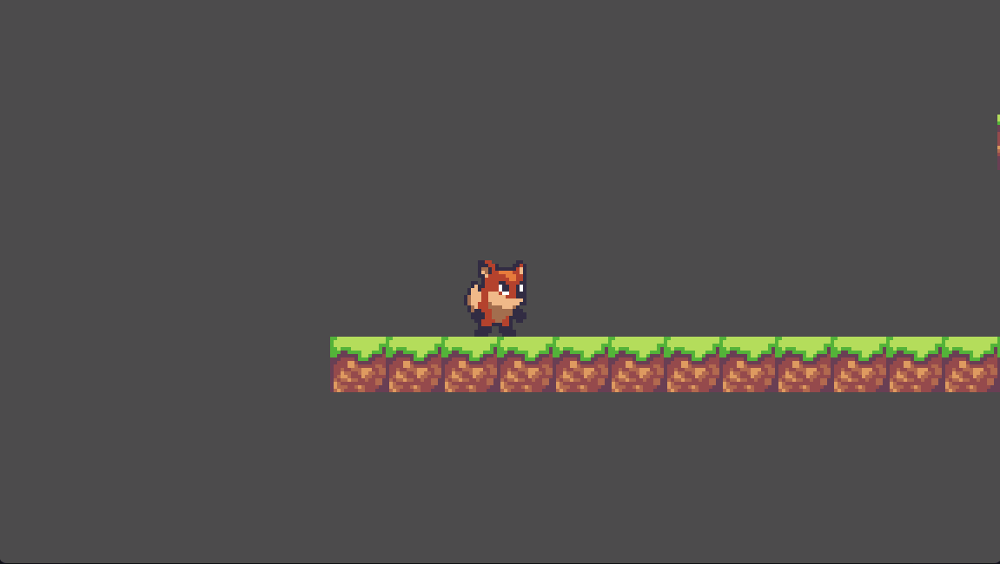

# Quest 3 - 조금 더 게임 답게
## 퀘스트 내용
1. 예제 에셋을 가지고 2D 캐릭터 및 2D 애니메이션을 만들어주세요
	- 예제 에셋: https://ansimuz.itch.io/sunny-land-pixel-game-art
2. 캐릭터가 땅 위에서 움직이도록 만들어주세요.
3. 중력을 적용하고 캐릭터에 점프 기능을 추가해주세요.

## 도움이 되는 질문
1. 애니메이션을 담당하는 게임 구성 요소는 무엇일까요?
2. '중력', '장애물'과 같은 물리 현상은 어떻게 구현해야 할까요? (keyword: rigid body, fixed time update)
	- Warning: 물리에 영향을 받는 물체는 위치를 직접 변경하면 안됩니다.

## 추가 퀘스트
1. 맵을 넓게 만들었을 때 게임 화면에서 캐릭터가 벗어나지 않도록 하세요. (keyword: camera)
2. 왼쪽으로 달릴 때, 오른쪽으로 달릴 때, 점프할 때 각각 다른 애니메이션을 재생하도록 만드세요.
3. 2D map을 손쉽게 만드는 방법을 찾아보세요. (Keyword: tilemap)
4. 캐릭터 점프 효과음을 추가해주세요.