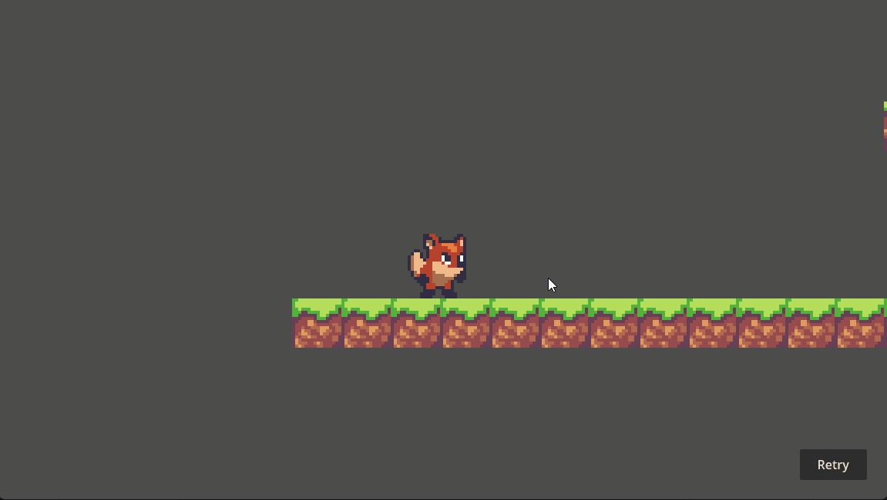
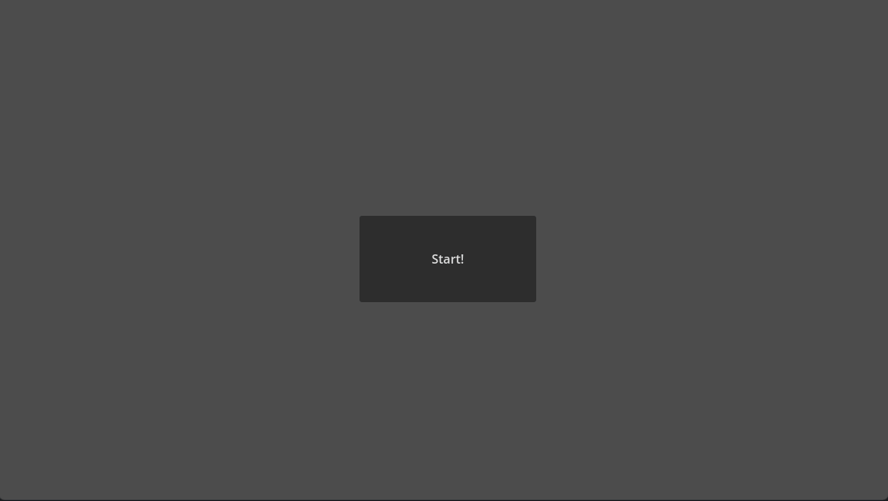
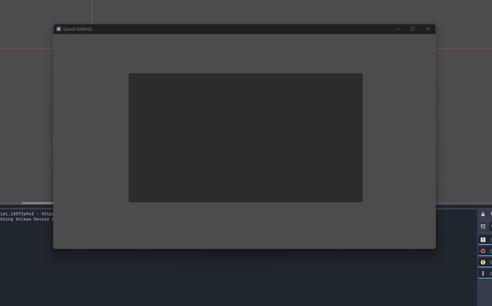
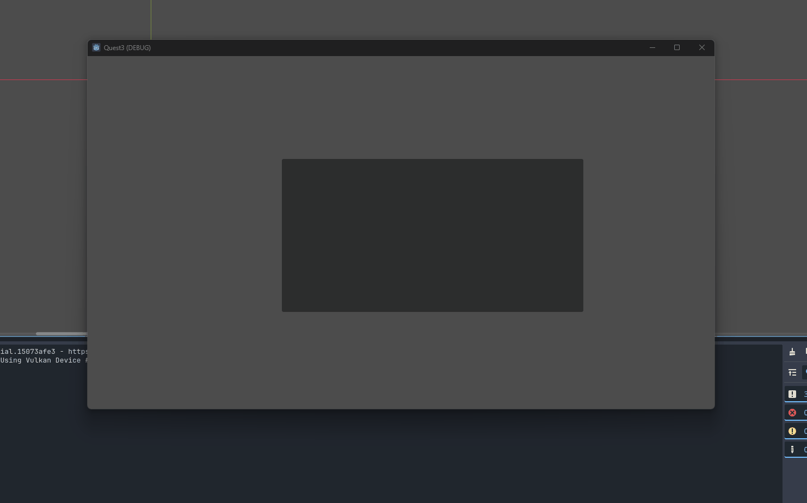
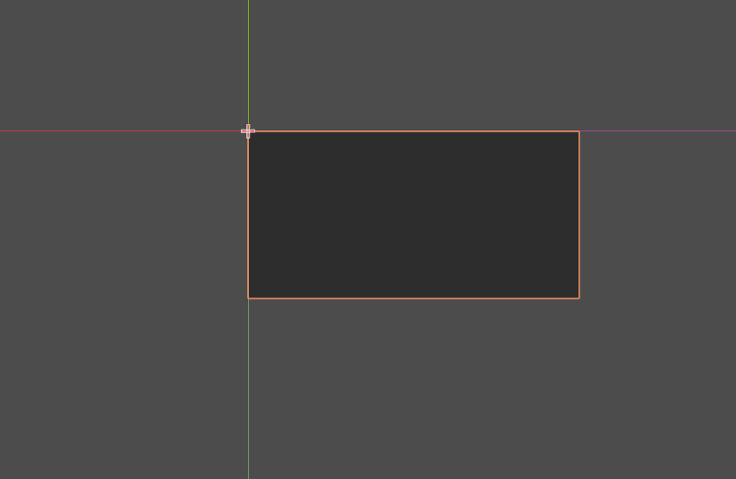
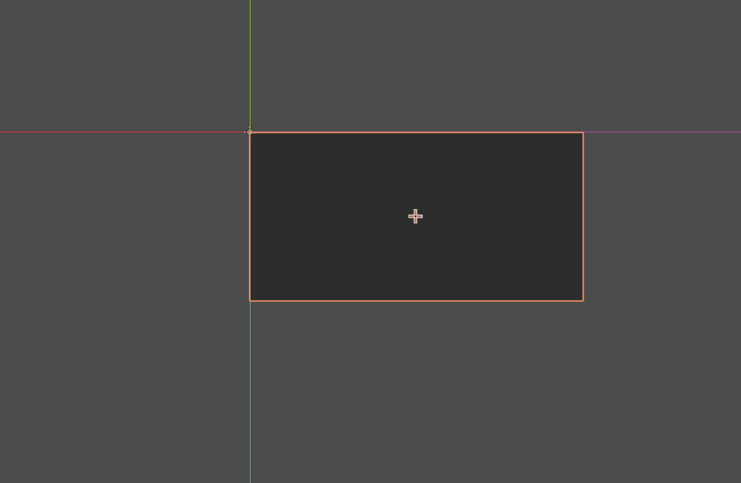

# Quest 4 - Front End
1. 게임 다시 시작 버튼을 만드세요.
	- 이 버튼은 카메라의 움직임과 상관 없이 화면 우측 하단에 고정되어 있어야 합니다.

2. front page scene과 여기에 게임 시작 버튼을 만들고 이 버튼을 누르면 game scene으로 넘어가는 기능을 추가해주세요.

## 도움이 되는 질문
1. 카메라와 상관 없는 UI 요소는 어떻게 scene에 추가해야 할까요?
2. UI는 일반적인 game 구성 요소와 배치 방법 (Transform)이 다른 경우가 많습니다. 어떻게 이용할까요? (Keyword: Anchor, Pivot)
	- Tip: 게임 해상도를 변경하였을 때, UI를 회전할 때 변화를 관찰해보세요.

## 추가 퀘스트
1. UI를 더 추가해보고 이를 정렬할 수 있는 방법을 찾아보세요.
	- e.g. 왼쪽 정렬, 중앙 정렬
2. Front page에서 BGM을 재생하고 게임 시작으로 넘어갔을 때 BGM을 처음부터 재생하지 않고 유지되는 기능을 추가해보세요.